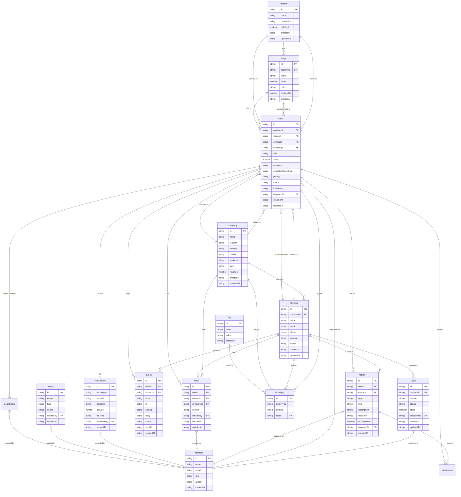

# SalesPipe CRM — 데이터베이스 설계

## localStorage 키 네이밍 규칙

형식: `sp_{entity}` — 접두사 `sp_` (SalesPipe) + 엔티티명 복수형 소문자 스네이크케이스

| localStorage 키 | 엔티티 | 값 타입 |
|----------------|--------|---------|
| `sp_pipelines` | Pipeline | `Pipeline[]` |
| `sp_stages` | Stage | `Stage[]` |
| `sp_companies` | Company | `Company[]` |
| `sp_contacts` | Contact | `Contact[]` |
| `sp_leads` | Lead | `Lead[]` |
| `sp_deals` | Deal | `Deal[]` |
| `sp_activities` | Activity | `Activity[]` |
| `sp_notes` | Note | `Note[]` |
| `sp_tags` | Tag | `Tag[]` |
| `sp_entity_tags` | EntityTag | `EntityTag[]` |
| `sp_emails` | Email | `Email[]` |
| `sp_attachments` | Attachment | `Attachment[]` |
| `sp_members` | Member | `Member[]` |
| `sp_reports` | Report | `Report[]` |
| `sp_settings` | AppSettings | `AppSettings` (객체) |
| `sp_deal_history` | DealHistory | `DealHistory[]` |
| `sp_notifications` | Notification | `Notification[]` |

---

## 엔티티 관계도 (Mermaid ERD)

---

## 엔티티별 필드 정의

### Pipeline
| 필드 | 타입 | 필수 | 설명 |
|------|------|------|------|
| id | string | ✓ | UUID (auto) |
| name | string | ✓ | 파이프라인 이름 |
| description | string | | 설명 |
| isDefault | boolean | ✓ | 기본 파이프라인 여부 (1개만 true) |
| createdAt | string | ✓ | ISO 8601 |
| updatedAt | string | ✓ | ISO 8601 |

### Stage
| 필드 | 타입 | 필수 | 설명 |
|------|------|------|------|
| id | string | ✓ | UUID (auto) |
| pipelineId | string | ✓ | FK → Pipeline.id |
| name | string | ✓ | 스테이지 이름 |
| order | number | ✓ | 표시 순서 (1부터 시작, 중복 없음) |
| color | string | ✓ | HEX 색상 코드 (예: `#3B82F6`) |
| probability | number | ✓ | 성사 확률 (0~100 정수) |
| createdAt | string | ✓ | ISO 8601 |

### Company
| 필드 | 타입 | 필수 | 설명 |
|------|------|------|------|
| id | string | ✓ | UUID (auto) |
| name | string | ✓ | 회사명 |
| industry | string | | 산업군 |
| website | string | | 웹사이트 URL |
| phone | string | | 대표 전화 |
| address | string | | 주소 |
| size | `'small'│'medium'│'large'│'enterprise'` | | 회사 규모 |
| revenue | number | | 연매출 (KRW 기준) |
| createdAt | string | ✓ | ISO 8601 |
| updatedAt | string | ✓ | ISO 8601 |

### Contact
| 필드 | 타입 | 필수 | 설명 |
|------|------|------|------|
| id | string | ✓ | UUID (auto) |
| companyId | string | | FK → Company.id (nullable) |
| name | string | ✓ | 이름 |
| email | string | ✓ | 이메일 (유니크) |
| phone | string | | 전화번호 |
| position | string | | 직함/직책 |
| avatar | string | | 아바타 URL |
| createdAt | string | ✓ | ISO 8601 |
| updatedAt | string | ✓ | ISO 8601 |

### Lead
| 필드 | 타입 | 필수 | 설명 |
|------|------|------|------|
| id | string | ✓ | UUID (auto) |
| contactId | string | ✓ | FK → Contact.id |
| source | `'web'│'referral'│'ad'│'event'│'other'` | ✓ | 유입 경로 |
| status | `'new'│'contacted'│'qualified'│'unqualified'` | ✓ | 상태 |
| score | number | ✓ | 리드 점수 (1~100) |
| assignedTo | string | ✓ | FK → Member.id |
| createdAt | string | ✓ | ISO 8601 |
| updatedAt | string | ✓ | ISO 8601 |

### Deal
| 필드 | 타입 | 필수 | 설명 |
|------|------|------|------|
| id | string | ✓ | UUID (auto) |
| pipelineId | string | ✓ | FK → Pipeline.id |
| stageId | string | ✓ | FK → Stage.id |
| contactId | string | ✓ | FK → Contact.id |
| companyId | string | | FK → Company.id (nullable) |
| title | string | ✓ | 딜 제목 |
| value | number | ✓ | 금액 |
| currency | `'KRW'│'USD'` | ✓ | 통화 단위 |
| expectedCloseDate | string | | 예상 마감일 (ISO 8601) |
| priority | `'low'│'medium'│'high'│'urgent'` | ✓ | 우선도 |
| status | `'open'│'won'│'lost'` | ✓ | 딜 상태 |
| lostReason | string | | 실패 사유 (status=lost일 때) |
| assignedTo | string | ✓ | FK → Member.id |
| createdAt | string | ✓ | ISO 8601 |
| updatedAt | string | ✓ | ISO 8601 |

### Activity
| 필드 | 타입 | 필수 | 설명 |
|------|------|------|------|
| id | string | ✓ | UUID (auto) |
| dealId | string | | FK → Deal.id (nullable) |
| contactId | string | | FK → Contact.id (nullable) |
| type | `'call'│'email'│'meeting'│'task'│'note'` | ✓ | 활동 유형 |
| title | string | ✓ | 제목 |
| description | string | | 상세 설명 |
| dueDate | string | | 마감일 (ISO 8601) |
| isCompleted | boolean | ✓ | 완료 여부 |
| assignedTo | string | ✓ | FK → Member.id |
| createdAt | string | ✓ | ISO 8601 |

### Note
| 필드 | 타입 | 필수 | 설명 |
|------|------|------|------|
| id | string | ✓ | UUID (auto) |
| dealId | string | | FK → Deal.id (nullable) |
| contactId | string | | FK → Contact.id (nullable) |
| companyId | string | | FK → Company.id (nullable) |
| content | string | ✓ | 노트 내용 |
| createdBy | string | ✓ | FK → Member.id |
| createdAt | string | ✓ | ISO 8601 |
| updatedAt | string | ✓ | ISO 8601 |

### Tag
| 필드 | 타입 | 필수 | 설명 |
|------|------|------|------|
| id | string | ✓ | UUID (auto) |
| name | string | ✓ | 태그 이름 (유니크) |
| color | string | ✓ | HEX 색상 코드 |
| createdAt | string | ✓ | ISO 8601 |

### EntityTag (다대다 연결)
| 필드 | 타입 | 필수 | 설명 |
|------|------|------|------|
| id | string | ✓ | UUID (auto) |
| entityType | `'deal'│'contact'│'company'` | ✓ | 연결 대상 엔티티 종류 |
| entityId | string | ✓ | 연결 대상 엔티티 ID |
| tagId | string | ✓ | FK → Tag.id |

### Email
| 필드 | 타입 | 필수 | 설명 |
|------|------|------|------|
| id | string | ✓ | UUID (auto) |
| dealId | string | | FK → Deal.id (nullable) |
| contactId | string | ✓ | FK → Contact.id |
| from | string | ✓ | 발신자 이메일 주소 |
| to | string | ✓ | 수신자 이메일 주소 |
| subject | string | ✓ | 제목 |
| body | string | ✓ | 본문 |
| status | `'sent'│'draft'│'scheduled'` | ✓ | 발송 상태 |
| sentAt | string | | 발송 시각 (ISO 8601, status=sent일 때) |
| createdAt | string | ✓ | ISO 8601 |

### Attachment
| 필드 | 타입 | 필수 | 설명 |
|------|------|------|------|
| id | string | ✓ | UUID (auto) |
| entityType | `'deal'│'contact'│'company'` | ✓ | 연결 대상 엔티티 종류 |
| entityId | string | ✓ | 연결 대상 엔티티 ID |
| fileName | string | ✓ | 원본 파일명 |
| fileSize | number | ✓ | 파일 크기 (bytes) |
| fileType | string | ✓ | MIME 타입 (예: `application/pdf`) |
| uploadedBy | string | ✓ | FK → Member.id |
| createdAt | string | ✓ | ISO 8601 |

### Member
| 필드 | 타입 | 필수 | 설명 |
|------|------|------|------|
| id | string | ✓ | UUID (auto) |
| name | string | ✓ | 이름 |
| email | string | ✓ | 이메일 (유니크) |
| role | `'admin'│'manager'│'sales'` | ✓ | 역할 |
| avatar | string | | 아바타 URL |
| createdAt | string | ✓ | ISO 8601 |

### Report
| 필드 | 타입 | 필수 | 설명 |
|------|------|------|------|
| id | string | ✓ | UUID (auto) |
| name | string | ✓ | 보고서 이름 |
| type | `'pipeline'│'sales'│'activity'│'forecast'` | ✓ | 보고서 유형 |
| config | string | ✓ | 보고서 설정 (JSON.stringify된 객체) |
| createdBy | string | ✓ | FK → Member.id |
| createdAt | string | ✓ | ISO 8601 |

### AppSettings (단일 객체)
| 필드 | 타입 | 설명 |
|------|------|------|
| defaultPipelineId | string | 기본 파이프라인 ID |
| defaultCurrency | `'KRW'│'USD'` | 기본 통화 |
| darkMode | boolean | 다크모드 활성화 여부 |

### DealHistory [Wave 5]
| 필드 | 타입 | 필수 | 설명 |
|------|------|------|------|
| id | string | ✓ | UUID (auto) |
| dealId | string | ✓ | FK → Deal.id |
| field | `'stageId'│'value'│'assignedTo'│'status'│'priority'│'title'` | ✓ | 변경된 필드명 |
| oldValue | string | ✓ | 변경 전 값 (문자열 직렬화) |
| newValue | string | ✓ | 변경 후 값 (문자열 직렬화) |
| changedBy | string | ✓ | FK → Member.id |
| createdAt | string | ✓ | ISO 8601 |

### Notification [Wave 5]
| 필드 | 타입 | 필수 | 설명 |
|------|------|------|------|
| id | string | ✓ | UUID (auto) |
| type | `'activity_due'│'deal_status_changed'│'deal_assigned'` | ✓ | 알림 유형 |
| title | string | ✓ | 알림 제목 |
| body | string | ✓ | 알림 본문 |
| entityType | `'activity'│'deal'` | ✓ | 연결 엔티티 종류 |
| entityId | string | ✓ | 연결 엔티티 ID |
| isRead | boolean | ✓ | 읽음 여부 |
| createdAt | string | ✓ | ISO 8601 |

---

## 관계 처리 방식

### FK 저장 방식
- 관계는 참조 ID 문자열만 저장 (실제 JOIN 없음)
- nullable FK는 `string | null` 또는 `string | undefined` 타입

### 조인 처리
서비스 레이어에서 각 localStorage 키를 개별 조회 후 메모리 내 병합:

| 서비스 함수 | 조인 대상 |
|------------|----------|
| `getDealById` | Contact, Company, Stage, Pipeline, Member |
| `getContactById` | Company, Deal[], Activity[], Note[], Email[] |
| `getCompanyById` | Contact[], Deal[], Note[] |
| `getLeads` | Contact, Member |

### 삭제 시 Cascade 처리

localStorage는 cascade delete 없으므로 서비스 레이어에서 명시적으로 처리:

| 삭제 대상 | 서비스 내 cleanup |
|----------|------------------|
| Pipeline 삭제 | 소속 Stage 삭제 → 해당 Stage의 Deal.stageId 처리 |
| Company 삭제 | Contact.companyId → null, 연결 Deal.companyId → null |
| Contact 삭제 | 연결된 Lead, Deal, Activity, Note, Email 삭제 |
| Deal 삭제 | 연결된 Activity, Note, Email, Attachment, EntityTag, **DealHistory** 삭제 |
| Tag 삭제 | 관련 EntityTag 레코드 전체 삭제 |
| Member 삭제 | 담당 딜/리드/활동의 assignedTo → null 처리 |
| Activity 삭제 | 연결된 **Notification** (entityType='activity') 삭제 |

### 다대다 관계 (EntityTag)
- 추가: EntityTag 레코드 생성 (`{entityType, entityId, tagId}`)
- 제거: `entityType + entityId + tagId` 조건으로 EntityTag 레코드 삭제
- 조회: `sp_entity_tags`에서 `entityType + entityId`로 필터 → `tagId`로 Tag 조회
